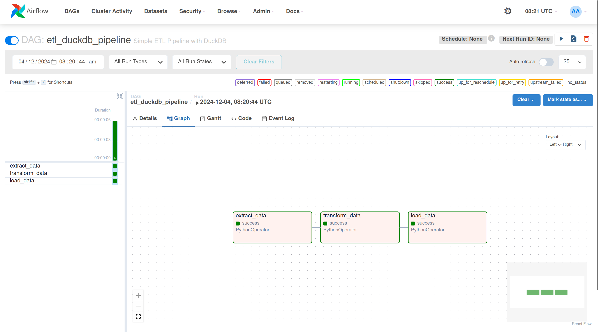

# ETL Pipeline with Airflow and DuckDB

A simple ETL (Extract, Transform, Load) pipeline that extracts data from a CSV file, transforms it using [DuckDB](https://duckdb.org/) by applying a 10% discount on product prices, and loads the transformed data back into a new CSV file. This project utilizes [Apache Airflow](https://airflow.apache.org/) for orchestrating the ETL tasks and uses a [Dev Container](https://containers.dev/) configuration for simplified development environment setup via [Daytona](daytona.io).


## Features

- **Easy Setup with Dev Container:** Quickly initialize and run the project with predefined configurations.
- **Airflow DAG Integration:** Orchestrate ETL tasks using Apache Airflow.
- **DuckDB for Transformation:** Utilize DuckDB for efficient in-memory data transformations.
- **Sample Data Included:** Comes with sample CSV data to test the ETL pipeline.
- **Automated Workflow:** End-to-end automation of data extraction, transformation, and loading.

## Understanding the ETL Pipeline

The ETL pipeline is composed of three main steps:

1. **Extract:** Reads data from the `products.csv` file.
2. **Transform:** Applies a **10% discount** to the `price` column using DuckDB.
3. **Load:** Writes the transformed data to `discounted_products.csv`.

### Step-by-Step Breakdown

**1. Extract Data:**

- The pipeline starts by reading the `products.csv` file located in the `data/` directory.
- This CSV contains product information with fields: `id`, `product_name`, and `price`.
- **Example:** Input (`products.csv`):

    | id | product_name | price |
    |----|--------------|-------|
    | 1  | Product A    | 100   |
    | 2  | Product B    | 200   |
    | 3  | Product C    | 150   |
    | 4  | Product D    | 50    |
    | 5  | Product E    | 80    |

**2. Transform Data:**

- The extracted data is passed to DuckDB, an in-process SQL OLAP database.
- A SQL query is executed to apply a 10% discount on the `price` column.
- The transformation results in a new column `discounted_price`.

**3. Load Data:**

- The transformed data, now with the discounted prices, is written to a new CSV file `discounted_products.csv` in the `output/` directory.
- This file can be used for further analysis or reporting.

- **Example:** Output (`discounted_products.csv`):

    | id | product_name | discounted_price |
    |----|--------------|------------------|
    | 1  | Product A    | 90.0             |
    | 2  | Product B    | 180.0            |
    | 3  | Product C    | 135.0            |
    | 4  | Product D    | 45.0             |
    | 5  | Product E    | 72.0             |

## Technologies Used

### [Apache Airflow](https://airflow.apache.org/)

An open-source platform to programmatically author, schedule, and monitor workflows. In this project, Airflow orchestrates the ETL tasks defined in the DAG (`Directed Acyclic Graph`).

### [DuckDB](https://duckdb.org/)

An in-process SQL OLAP database management system, ideal for handling analytical query workloads. DuckDB is used here for its efficiency in performing SQL operations on data frames.

### [Python](https://www.python.org/)

Used for scripting the ETL tasks and defining the Airflow DAG. Python operators are utilized to define the extract, transform, and load functions.

### [Daytona](daytona.io)

A tool that simplifies the creation and management of development environments. Daytona automates the setup of the development workspace using the provided Dev Container configuration.

### [Dev Container](https://containers.dev/)

A development environment containerized with Docker, ensuring consistent setups across different machines. The Dev Container includes all necessary dependencies and configurations for the project.

## Setting Up the Development Workspace

### Requirements

- **Daytona:** Ensure you have Daytona installed.

- **Docker:** Docker should be installed and running on your machine.

- **Daytona Server:** Start the Daytona server using `daytona serve` command:

### Steps to Set Up Daytona Workspace

**1. Create and Open the Workspace in Daytona**

Use the following command to initialize your Daytona workspace:

```bash
daytona create https://github.com/daytonaio-experiments/starter-duckdb-airflow.git
```

This will open the workspace with all the defined configurations in `devcontainer.json`.

**2. Activate the Virtual Environment**

Activate the virtual environment with this command:

```bash
source airflow_venv/bin/activate
```

**3. Initialize the Airflow Database**

To set up the Airflow database, execute:

```bash
airflow db init
```

**4. Create an Airflow User**

Create an admin user for Airflow by running the following command (customize the credentials as needed):

```bash
airflow users create \
    --role Admin \
    --username admin \
    --email admin \
    --firstname admin \
    --lastname admin \
    --password admin
```

**5. Start the Airflow Scheduler**

Start the Airflow Scheduler to enable DAG execution:

```bash
airflow scheduler
```

**6. Start the Airflow Web Server**

In a separate terminal (after activating the virtual environment), start the Airflow web server:

```bash
airflow webserver -p 8080
```
Once the server is running, open your browser and visit http://localhost:8080. Log in using the admin credentials you created earlier.

Wait for 1-2 minutes for the DAGs to appear and locate the `etl_duckdb_pipeline` in the DAGs list.

**7. Run the DAG**

Click the play icon next to your DAG to trigger the pipeline.



**8. View the Output**

After the pipeline successfully executes, you can view the output at the `output/discounted_products.csv` directory.

```bash
cat output/discounted_products.csv
```

This will display the contents of the CSV file, confirming the execution of your pipeline.

Expected Output:

```
id,product_name,discounted_price
1,Product A,90.0
2,Product B,180.0
3,Product C,135.0
4,Product D,45.0
5,Product E,72.0
```

## Dev Container Configuration

```json
{
    "name": "ETL Pipeline with Airflow and DuckDB",
    "image": "ubuntu:22.04",
    "features": {
        "ghcr.io/devcontainers/features/common-utils:2.5.2": {
            "username": "daytona",
            "userUid": 1000,
            "userGid": 1000,
            "configureZshAsDefaultShell": true
        },
        "ghcr.io/devcontainers/features/git:1": {},
        "ghcr.io/devcontainers/features/python:1.6.5": {
            "version": "3.10",
            "installPip": true
        }
    },
    "overrideFeatureInstallOrder": [
        "ghcr.io/devcontainers/features/common-utils",
        "ghcr.io/devcontainers/features/git",
        "ghcr.io/devcontainers/features/python"
    ],
    "workspaceFolder": "/workspace/starter-duckdb-airflow",
    "customizations": {
        "vscode": {
            "extensions": [
                "ms-python.python",
                "ms-python.vscode-pylance",
                "ms-toolsai.jupyter"
            ]
        }
    },
    "portsAttributes": {
        "8080": {
            "label": "Airflow Web UI",
            "onAutoForward": "notify"
        },
        "8793": {
            "label": "Airflow Scheduler",
            "onAutoForward": "notify"
        }
    },
    "containerEnv": {
        "AIRFLOW_HOME": "/workspace/starter-duckdb-airflow"
    },
    "remoteUser": "daytona",
    "postCreateCommand": "pip install --upgrade pip && pip install apache-airflow pandas duckdb pyarrow && python3 -m venv airflow_venv"
}
```

### Configuration Highlights
- **Name:** Sets the Dev Container name to **ETL Pipeline with Airflow and DuckDB**.
- **Base Image:** Uses Ubuntu 22.04 as the base image.
- **Features:**
    - **Common Utils:** Includes utilities like `sudo`, `curl`, and `wget`. Sets up the user `daytona` with UID and `1000`, and configures Zsh as the default shell.
    - **Git:** Installs Git for version control.
    - **Python:** Installs Python 3.10 with `pip`.
- **Workspace Folder:** Sets the workspace directory to `/workspace/starter-duckdb-airflow`.
- **Customizations:**
    - **VSCode Extensions:** Pre-installs Python and Jupyter extensions for enhanced development experience.
- **Ports Attributes:**
    - **8080:** Forwards Airflow Web UI with a label and notification on auto-forward.
    - **8793:** Forwards Airflow Scheduler with a label and notification on auto-forward.
- **Container Environment:**
    - **AIRFLOW_HOME:** Sets the Airflow home directory to the workspace folder.
- **Remote User:** Sets the user inside the container to `daytona`.
- **Post Create Command:** 
    - Upgrades `pip` and installs required Python packages (`apache-airflow`, `pandas`, `duckdb`, `pyarrow`).
    - Creates a virtual environment named `airflow_venv` for better package isolation.

## Why Daytona?
Daytona is a radically simple open source development environment manager.

Setting up development environments has become increasingly challenging over time, especially when aiming to set up remotely, where the complexity increases by an order of magnitude. The process is so complex that we've compiled a [comprehensive guide](https://www.daytona.io/dotfiles/diy-guide-to-transform-any-machine-into-a-codespace) detailing all the necessary steps to set one up—spanning __5,000 words__, __7 steps__, and requiring anywhere from 15 to __45 minutes__.

This complexity is unnecessary.

With Daytona, you need only to execute a single command: `daytona create`.

Daytona automates the entire process; provisioning the instance, interpreting and applying the configuration, setting up prebuilds, establishing a secure VPN connection, securely connecting your local or a Web IDE, and assigning a fully qualified domain name to the development environment for easy sharing and collaboration.

As a developer, you can immediately start focusing on what matters most—your code.

## Backstory
We spent most of our careers building cloud development environments. In 2009, we launched what was likely the first commercial [Cloud IDE](https://codeanywhere.com) project. At that time, technology was lacking, forcing us to develop everything from scratch—the IDE, the environment orchestrator, and almost everything else. A lot of people were interested, and over 2.5 million developers signed up! But we were too early, and we asked too much from our users to change how they worked.

Now, 15 years since its inception, we have noticed quite a few things. First, the technology we wished for back then exists now. Second, approximately 50% of developers work in remote dev environments, and third, and most importantly, setting up development environments has become more complex than ever, both locally and to a greater magnitude for remote.

So, we took everything we learned and decided to solve these issues once and for all as a fully open-source project. Our goal was to create a single binary that allows you to set up a development environment anywhere you wish, completely free, and finally fulfill the promise that many have attempted to make.


## Getting Started
### Requirements
Before starting the installation script, please go over all the necessary requirements:
- __Hardware Resources__: Depending on the project requirements, ensure your machine has sufficient resources. Minimum hardware specification is 1cpu, 2GB of RAM and 10GB of disk space.
- __Docker__: Ensure [Docker](https://www.docker.com/products/docker-desktop/) is installed and running.


### Installing Daytona
Daytona allows you to manage your Development Environments using the Daytona CLI. To install it, please execute the following command:

```bash
# Install Daytona into /usr/local/bin
curl -sf -L https://download.daytona.io/daytona/install.sh | sudo bash

# OR if you want to install Daytona to some other path where you don`t need sudo
# curl -sf -L https://download.daytona.io/daytona/install.sh | DAYTONA_PATH=/home/user/bin bash
```
<details open>
  <summary> Manual installation </summary>
  If you don't want to use the provided script, download the binary directly from the URL for your specific OS:

  ```bash
  curl -sf -L https://download.daytona.io/daytona/latest/daytona-darwin-amd64 -o daytona
  curl -sf -L https://download.daytona.io/daytona/latest/daytona-darwin-arm64 -o daytona
  curl -sf -L https://download.daytona.io/daytona/latest/daytona-linux-amd64 -o daytona
  curl -sf -L https://download.daytona.io/daytona/latest/daytona-linux-arm64 -o daytona
  curl -sf -L https://download.daytona.io/daytona/latest/daytona-windows-amd64.exe -o daytona
  curl -sf -L https://download.daytona.io/daytona/latest/daytona-windows-arm64.exe -o daytona
  ```
  Make sure that path where `daytona` binary is downloaded is in your system PATH.
</details>


### Initializing Daytona
To initialize Daytona, follow these steps:

__1. Start the Daytona Server:__
This initiates the Daytona Server in daemon mode. Use the command:
```bash
daytona server
```
__2. Add Your Git Provider of Choice:__
Daytona supports GitHub, GitLab, Bitbucket, Bitbucket Server, Gitea, Gitness, AWS CodeCommit, Azure DevOps and Gogs. To add them to your profile, use the command:
```bash
daytona git-providers add

```
Follow the steps provided.

__3. Add Your Provider Target:__
This step is for choosing where to deploy Development Environments. By default, Daytona includes a Docker provider to spin up environments on your local machine. For remote development environments, use the command:
```bash
daytona target set
```
Following the steps this command adds SSH machines to your targets.

__4. Choose Your Default IDE:__
The default setting for Daytona is VS Code locally. If you prefer, you can switch to VS Code - Browser or any IDE from the JetBrains portfolio using the command:
```bash
daytona ide
```
Now that you have installed and initialized Daytona, you can proceed to setting up your development environments and start coding instantly.


### Creating Dev Environments
Creating development environments with Daytona is a straightforward process, accomplished with just one command:
```bash
daytona create
```

You can add the `--no-ide` flag if you don't wish to open the IDE immediately after creating the environment.

Upon executing this command, you will be prompted with two questions:
1. Choose the provider to decide where to create a dev environment.
2. Select or type the Git repository you wish to use to create a dev environment.

After making your selections, press enter, and Daytona will handle the rest. All that remains for you to do is to execute the following command to open your default IDE:
```bash
daytona code
```

This command opens your development environment in your preferred IDE, allowing you to start coding instantly.

### Stopping the Daytona Server:
```bash
daytona server stop
```

### Restarting the Daytona Server:
```bash
daytona server restart
```

## How to Extend Daytona

Daytona offers flexibility for extension through the creation of plugins and providers.


### Providers
Daytona is designed to be infrastructure-agnostic, capable of creating and managing development environments across various platforms. Providers are the components that encapsulate the logic for provisioning compute resources on a specific target platform. They allow for the configuration of different targets within a single provider, enabling, for instance, multiple AWS profiles within an AWS provider.

How does it work? When executing the `daytona create` command, Daytona communicates the environment details to the selected provider, which then provisions the necessary compute resources. Once provisioned, Daytona sets up the environment on these resources, allowing the user to interact with the environment seamlessly.

Providers are independent projects that adhere to the Daytona Provider interface. They can be developed in nearly any major programming language. More details coming soon.


### Plugins
Plugins enhance Daytona's core functionalities by adding new CLI commands, API methods, or services within the development environments. They offer configurable settings to tailor the plugin's behavior to the user's needs.

Similar to providers, plugins are independent projects that conform to the Daytona Plugin interface and can be developed in a wide range of programming languages. More details coming soon.


## Contributing


Daytona is Open Source under the [Apache License 2.0](LICENSE), and is the [copyright of its contributors](NOTICE). If you would like to contribute to the software, you must:

1. Read the Developer Certificate of Origin Version 1.1 (https://developercertificate.org/)
2. Signing all commits to the Daytona project.

This ensures that users, distributors, and other contributors can rely on all the software related to Daytona being contributed under the terms of the [License](LICENSE). No contributions will be accepted without following this process.

Afterwards, navigate to the [contributing guide](CONTRIBUTING.md) to get started.

## License


This repository contains Daytona, covered under the [Apache License 2.0](LICENSE), except where noted (any Daytona logos or trademarks are not covered under the Apache License, and should be explicitly noted by a LICENSE file.)

Daytona is a product produced from this open source software, exclusively by Daytona Platforms, Inc. It is distributed under our commercial terms.

Others are allowed to make their own distribution of the software, but they cannot use any of the Daytona trademarks, cloud services, etc.

We explicitly grant permission for you to make a build that includes our trademarks while developing Daytona itself. You may not publish or share the build, and you may not use that build to run Daytona for any other purpose.

You can read more in our [packinging guidelines](PACKAGING.md).

## Code of Conduct


This project has adapted the Code of Conduct from the [Contributor Covenant](https://www.contributor-covenant.org/). For more information see the [Code of Conduct](CODE_OF_CONDUCT.md) or contact [codeofconduct@daytona.io.](mailto:codeofconduct@daytona.io) with any additional questions or comments.

## Questions


For more information on how to use and develop Daytona, talk to us on
[Slack](https://go.daytona.io/slack).